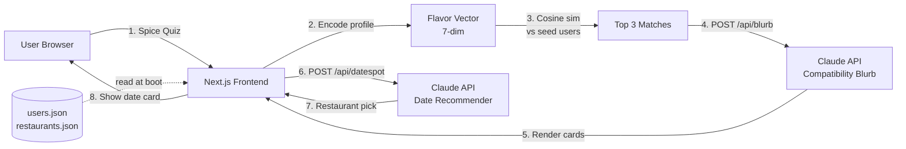
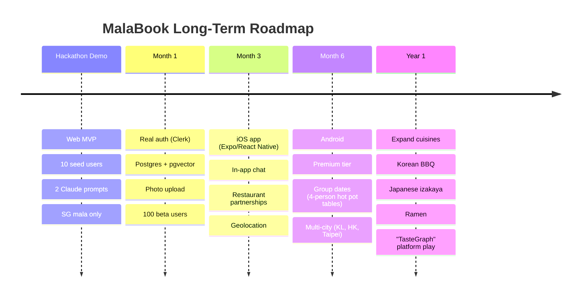

# 🌶️ MalaBook — Hackathon MVP Requirements

> **"The Spicy Way to Find The One"**
> Singapore AI Engineer Hackathon · Day-of Build Plan

---

## 1. Product Vision

MalaBook is a flavor-first dating app that matches people based on their Chinese spice preferences — dry stir-fry (干锅 / 麻辣香锅) vs numbing soup (麻辣烫 / 火锅), spice tolerance, and favorite ingredients (lotus root, beef tripe, enoki, tofu skin, etc.). The AI suggests a perfect mala spot for the first date so users skip the awkward *"where should we eat?"* conversation.

**Tagline:** *Match by mala. Meet over málà.*

---

## 2. Hackathon Day Schedule

| Time | Event | Your Mode |
|---|---|---|
| 8:30 AM | Registration | Set up laptop, get coffee |
| 9:00 AM | Kickoff (10 min) | Listen, then **GO** |
| 9:10 AM – 12:00 PM | Build Block 1 (~2h 50m) | Heads-down: setup → AI routes |
| 12:00 PM – 12:45 PM | Lunch | **Eat fast, then keep building** |
| 12:45 PM – 5:00 PM | Build Block 2 (~4h 15m) | UI → polish → submit |
| 5:00 PM | **🚨 SUBMISSION DEADLINE** | Pencils down |
| 5:00 – 6:15 PM | Prelim judging | Rest, demo if visited |
| 6:15 PM | Finalists announced | 🤞 |
| 6:15 – 7:15 PM | Final presentations | Pitch on stage |
| 7:30 PM | Winners announced | 🏆 |
| 7:30 – 8:00 PM | Wrap-up + networking | Talk to judges |

**Total focused build time: ~7h 5m.**
**Internal deadline: 4:30 PM** — leaves 30 min for submission + buffer.

---

## 3. Hackathon-Scoped MVP

The judges need to **see and feel the concept in under 3 minutes**. Build the smallest demo that tells the full story end-to-end. Cut anything that isn't on this list.

### Core Features (must-have)

| # | Feature | Description |
|---|---|---|
| F1 | **Flavor Profile Onboarding** | 5–7 quick questions: dry vs soup, spice level (1–5 chilis), top 3 favorite ingredients, broth preference, dining vibe |
| F2 | **Profile Card** | Name, age, avatar, flavor summary, spice badge ("3-Chili Warrior"), top ingredients |
| F3 | **AI-Powered Matching** | Cosine similarity on flavor vectors + LLM-generated "Why you match" blurb. Top 3 matches in a feed. |
| F4 | **AI Date Spot Recommender** | LLM picks one Singapore mala restaurant for the matched pair with reasoning |
| F5 | **Minimal UI** | Onboarding screen → match feed → match detail with date suggestion |

### Stretch Goals (only after F1–F5 are bulletproof)

- **S1.** Streaming Claude responses so blurbs "type out" live
- **S2.** Light animation on the splash screen (steam/flame)
- **S3.** "Skip onboarding — use sample profile" demo shortcut
- **S4.** Restaurant card images (Unsplash or static URLs)

### Demo Seed Data

- 8–10 fake user profiles with varied flavor vectors
- 6–8 real Singapore mala spots (Chuan's Kitchen, Riverside Indo, Yang Guo Fu, Hai Di Lao, Xiao Long Kan, Ri Ri Hong, Birds of a Feather, Mala Hot Pot @ Bugis)

### Explicitly Out of Scope

❌ Real auth · ❌ Real chat · ❌ Backend database · ❌ Native mobile build · ❌ Geolocation/maps · ❌ Payments · ❌ Photo upload

---

## 4. Recommended Tech Stack

| Layer | Choice | Why |
|---|---|---|
| **Frontend** | Next.js 14 (App Router) + Tailwind + shadcn/ui | Beautiful components in 2 minutes |
| **AI** | Anthropic Claude API (`claude-sonnet-4-5`) | Two prompt templates, one key |
| **Data** | Hardcoded JSON (`users.json`, `restaurants.json`) | No DB to set up |
| **Matching** | Cosine similarity on a 7-dim flavor vector | ~5 lines of pure JS |
| **Hosting** | Vercel one-click, or local for the demo | Zero config |
| **Style** | Red/orange/black mala palette, chili emoji 🌶️ ratings | Sells the brand instantly |

---

## 5. Data Model

```ts
type User = {
  id: string;
  name: string;
  age: number;
  avatar: string;                              // dicebear url
  bio: string;
  flavorProfile: {
    style: "dry" | "soup" | "both";            // 干锅 vs 麻辣烫
    spiceLevel: 1 | 2 | 3 | 4 | 5;             // chili count
    topIngredients: string[];                  // ["lotus root", "beef tripe"]
    brothPreference: "mala" | "tomato" | "mushroom" | "split";
    vibe: "loud-group" | "intimate-booth" | "casual";
  };
  flavorVector: number[];                      // 7-dim, derived
};

type Restaurant = {
  id: string;
  name: string;
  nameZh: string;
  neighborhood: string;
  style: "dry" | "soup" | "both";
  spiceRange: [number, number];
  signature: string[];
  vibe: string;
  priceRange: "$" | "$$" | "$$$";
};
```

---

## 6. AI Integration

You have **two Claude API call sites**. Keep prompts short — every token costs you demo latency.

### Prompt 1 — Match Compatibility Blurb

```
System: You write playful 1-sentence dating compatibility blurbs based on
        Chinese mala (numbing-spicy) food preferences. Tone: flirty,
        confident, food-poetic. Max 25 words.

User:   User A loves {style} mala at level {n}, favorites: {ingredients}.
        User B loves {style} at level {n}, favorites: {ingredients}.
        Why are they a flavor match?
```

### Prompt 2 — Date Spot Recommender

```
System: You are a Singapore mala expert. Given two diners' flavor profiles
        and a list of restaurants, pick exactly ONE and justify in 2
        sentences. Output JSON: {restaurantId, reason}.

User:   Diner profiles: {...}. Restaurants: {...}. Pick the best date spot.
```

---

## 7. UI / UX Screens

Three screens, mobile-first viewport (max-width ~420px, centered) — sells the "phone app" vision even on a laptop demo.

### Screen 1 — Onboarding (the spice quiz)
- 5 questions, one screen, controlled state
- Big chili-icon spice slider (1–5 🌶️)
- Multi-select chips for ingredients
- **"Find My Match 🌶️"** CTA at the end

### Screen 2 — Match Feed
- 3 match cards, vertical scroll
- Each card: avatar, name/age, spice badge, top 2 shared ingredients, AI blurb, **"View Date Idea"** button

### Screen 3 — Match Detail + Date Suggestion
- Bigger profile view
- AI-generated restaurant card: name, neighborhood, why this place
- **"Suggest This Date"** button (mock — confirmation toast)

### Design Tokens

| Element | Value |
|---|---|
| Deep red | `#B91C1C` |
| Hot orange | `#EA580C` |
| Off-black | `#1A1A1A` |
| Cream | `#FFF7ED` |
| Header font | ZCOOL XiaoWei (Chinese-inspired) |

---

## 8. The Day's Roadmap

```mermaid
gantt
    title MalaBook Hackathon — Day Plan
    dateFormat HH:mm
    axisFormat %H:%M

    section Pre-Build
    Registration & coffee                      :done, p1, 08:30, 30m
    Kickoff briefing                           :done, p2, 09:00, 10m

    section Block 1 - Backend & AI
    Project scaffold + API smoke test          :a1, 09:10, 30m
    Seed data (users + restaurants)            :a2, after a1, 35m
    Flavor vector + cosine similarity          :a3, after a2, 30m
    Claude API route - match blurb             :a4, after a3, 35m
    Claude API route - date recommender        :a5, after a4, 35m
    Buffer / curl-test everything              :a6, after a5, 15m

    section Lunch
    Lunch (eat fast, sketch UI)                :crit, lunch, 12:00, 45m

    section Block 2 - UI & Polish
    Onboarding screen                          :b1, after lunch, 60m
    Match feed screen                          :b2, after b1, 60m
    Match detail + date card                   :b3, after b2, 50m
    Theme, fonts, mobile frame, polish         :b4, after b3, 40m
    Demo rehearsal x2                          :b5, after b4, 25m
    Submission + buffer                        :crit, sub, 16:30, 30m

    section Submission
    DEADLINE                                   :milestone, 17:00, 0m
```



### Block 1: 9:10 AM – 12:00 PM (Backend + AI)

> **Goal by lunch:** working API endpoints. Zero UI is fine.

#### `9:10 – 9:40` — Setup
- [ ] `npx create-next-app@latest malabook --ts --tailwind --app`
- [ ] `npx shadcn@latest init` then add `button`, `card`, `slider`, `badge`, `input`
- [ ] Add `ANTHROPIC_API_KEY` to `.env.local`
- [ ] Smoke-test API call to `/v1/messages` — confirm it works
- [ ] First git commit + push

#### `9:40 – 10:15` — Seed Data
- [ ] `data/users.json` — 10 diverse profiles
- [ ] `data/restaurants.json` — 6–8 real SG mala spots
- [ ] Avatars via DiceBear: `https://api.dicebear.com/7.x/avataaars/svg?seed={name}`

#### `10:15 – 10:45` — Matching Engine
- [ ] `lib/flavor.ts` — `encodeProfile(user)` → 7-dim vector
- [ ] `lib/match.ts` — `cosineSimilarity(a, b)` and `findTopMatches(user, all, k=3)`
- [ ] Test in a Node script — sensible matches?

#### `10:45 – 11:20` — AI Route 1: Blurb
- [ ] `app/api/blurb/route.ts` — POST `{ userA, userB }` → `{ blurb }`
- [ ] Curl-test, save 3 sample outputs as fallback cache

#### `11:20 – 11:55` — AI Route 2: Date Spot
- [ ] `app/api/datespot/route.ts` — POST `{ userA, userB }` → `{ restaurantId, reason }`
- [ ] Curl-test, verify JSON output is parseable

#### `11:55 – 12:00` — Commit + Push
- [ ] Push everything before lunch (in case wifi dies later)

---

### 🍱 12:00 – 12:45 — Lunch

**Don't skip it, but don't linger.** Eat in 25 minutes, sketch the UI on a napkin for the remaining 20. By the time you sit back down, you should know exactly what each screen looks like.

---

### Block 2: 12:45 PM – 4:30 PM (UI + Polish)

> **Goal by 4:30:** working end-to-end demo. Everything after is buffer.

#### `12:45 – 1:45` — Onboarding Screen
- [ ] 5-question form, single scroll, no fancy carousel
- [ ] Controlled state with `useState`
- [ ] On submit → encode profile → store in `sessionStorage` → route to `/matches`

#### `1:45 – 2:45` — Match Feed
- [ ] Read user from sessionStorage, run matching client-side
- [ ] Render 3 cards
- [ ] Call `/api/blurb` for each (parallel `Promise.all`)
- [ ] Loading skeleton while blurbs generate

#### `2:45 – 3:35` — Match Detail + Date Card
- [ ] Click card → route to `/match/[id]`
- [ ] On load: call `/api/datespot`, render restaurant card
- [ ] **"Suggest This Date"** button → toast "Sent! 🌶️"

#### `3:35 – 4:15` — Theme & Polish
- [ ] Apply mala color palette globally
- [ ] ZCOOL XiaoWei font from Google Fonts for headers
- [ ] Mobile frame: `max-w-[420px] mx-auto` with rounded corners + phone-like shadow
- [ ] Chili icon ratings (lucide-react `Flame` or emoji)
- [ ] Splash/landing page if time allows

#### `4:15 – 4:30` — Demo Rehearsal
- [ ] End-to-end run-through **twice**
- [ ] Pre-cache blurbs if Claude is slow
- [ ] Hardcode "current user" so demo is deterministic

---

### Submission Window: 4:30 – 5:00 PM

- [ ] Final commit + push
- [ ] Deploy to Vercel (or local backup ready)
- [ ] Submit per hackathon instructions (form, repo link, demo URL, video?)
- [ ] **Submitted by 4:50 PM** — leaves 10 min for unforeseen issues

---

## 9. Critical Decision Points

| Time | If you're behind, then... |
|---|---|
| **12:00 PM** (lunch) | If AI routes aren't working: ship hardcoded blurbs and one hardcoded restaurant. **Cut Prompt 2 entirely.** |
| **2:45 PM** | If onboarding is broken: skip it. Hardcode "current user" and jump straight to match feed for the demo. |
| **3:35 PM** | If you only have 2 of 3 screens: that's fine. Onboarding + match feed is the core story. |
| **4:30 PM** | Stop building. Commit, push, deploy, submit. **No new features after 4:30.** |

> **The 15-minute rule:** never debug for more than 15 minutes. If something is broken, mock it and move on.

---

## 10. Final Presentation Strategy (6:15 – 7:15 PM, if finalist)

You'll likely have **3–5 minutes on stage**. Tightened version of the demo script:

| Time | Beat |
|---|---|
| `0:00 – 0:20` | Hook: "Singapore has the best mala outside of Chengdu. Couples can't agree on where to eat. We fix that." |
| `0:20 – 1:30` | Live demo: onboarding → matches → date suggestion |
| `1:30 – 2:15` | "How it works": flavor vector + 2 Claude prompts. Show code briefly. |
| `2:15 – 3:00` | Roadmap + ask: native app, real chat, OpenTable, expand to other cuisines |

**Backup plan if live demo fails on stage:** have a 60-second screen recording on your laptop. Play it muted while you narrate.

**Between 5:00 PM and 6:15 PM:** rest, hydrate, eat something. Don't keep tweaking — you'll only break things.

---

## 11. System Architecture



---

## 12. Demo Script (3 minutes — rehearse this!)

### `0:00 – 0:20` — Hook
> *"Singapore has the best mala in the world outside of Chengdu. But ask any couple their first-date horror story and it's 'we couldn't agree on where to eat.' MalaBook fixes that. We match people by **how** they eat málà."*

### `0:20 – 1:30` — Live Demo
- Open onboarding: *"I'm a Level 4 dry-pot person, I love lotus root, beef tripe, and enoki."*
- Submit → match feed appears with 3 cards
- Read out one AI-generated blurb
- Tap into a match → AI suggests Chuan's Kitchen with reasoning
- *"Two taps. AI did the matchmaking and booked the vibe."*

### `1:30 – 2:15` — How It Works
- Show the flavor vector encoding
- Show the two Claude prompts
- Mention: cosine sim for retrieval, LLM for the human-readable layer — a classic **embeddings + generative** pattern

### `2:15 – 3:00` — Roadmap & Ask
- Long-term: native iOS/Android, real-time chat, OpenTable integration, expansion to other cuisines
- Ask judges: feedback on matching dimensions, ideas for monetization

---

## 13. Post-Hackathon Roadmap



### Key Technical Evolutions
- JSON seed → Postgres + pgvector for real embedding search
- Replace LLM matching with a small fine-tuned classifier; keep LLM for the human-readable layer
- Restaurant ingestion pipeline (scrape menus, auto-tag spice/style)
- *"Did you actually go?"* feedback loop to learn match quality
- Privacy: never store exact location, only neighborhood-level

---

## 14. Pre-Hackathon Checklist *(do tonight!)*

- [ ] Anthropic API key working — make one curl call from your laptop
- [ ] Node 20+ installed, npm/pnpm working
- [ ] Git + GitHub repo created and cloned locally
- [ ] VS Code with Tailwind extension
- [ ] Vercel CLI logged in and tested with a hello-world deploy
- [ ] Laptop charger + a backup phone hotspot
- [ ] List of 8 SG mala spots written down (in case wifi is sketchy)
- [ ] 1-slide title card with "MalaBook 🌶️" and your name
- [ ] Set 3 alarms for tomorrow: **12:00 PM** (lunch), **4:30 PM** (stop building), **5:00 PM** (deadline)
- [ ] Sleep before midnight. The mala will be there tomorrow.

---

## 15. Risks & Mitigations

| Risk | Mitigation |
|---|---|
| Claude API rate limit or outage | Cache 5 pre-generated blurbs and date picks as fallback |
| Hackathon wifi dies | Have everything running locally; Vercel deploy is backup not primary |
| Spending 2 hours on UI polish | shadcn defaults; polish only after 3:35 PM |
| Onboarding too long for demo | Add "Skip — use sample profile" button (S3 stretch) |
| Judges ask "is this real food data?" | Be honest — seed data, but show the vector + prompt code |
| Tailwind config rabbit hole | Ship by 9:40 with ugly UI. Polish only after F1–F4 work. |
| Live demo fails on stage | 60-second screen recording on laptop as backup |
| Stage fright at finalist round | Rehearse the 3-min demo a third time at 5:30 PM if you make finalist |

---

> ## 🌶️🍲 Go build it. The mala waits for no one.
