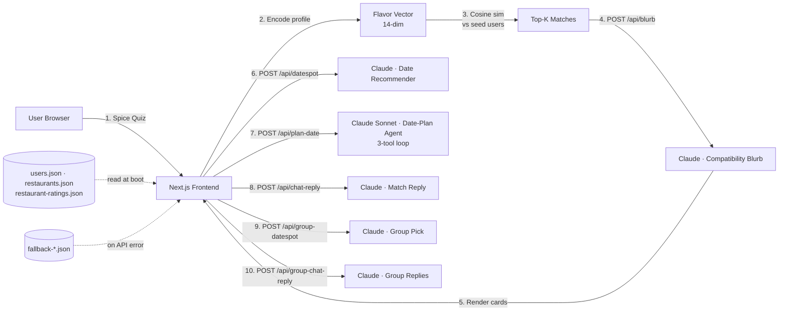

# Architecture

A flavor-first dating app on Next.js 16 (App Router) + React 19 + Tailwind v4 + shadcn/ui. No database — `data/*.json` is the source of truth and `sessionStorage` holds the current user.

## System diagram



## Data model

```ts
type User = {
  id: string;
  name: string;
  age: number;
  avatar: string;                              // /avatars/{id}.png
  bio: string;
  flavorProfile: {
    style: "dry" | "soup" | "both";            // 干锅 vs 麻辣烫
    spiceLevel: 1 | 2 | 3 | 4 | 5;             // chili count
    topIngredients: string[];                  // e.g. ["lotus root", "beef tripe"]
    brothPreference: "mala" | "tomato" | "mushroom" | "split";
    vibe: "loud-group" | "intimate-booth" | "casual";
  };
  flavorVector: number[];                      // 14-dim, derived
};

type Restaurant = {
  id: string;
  name: string;
  nameZh: string;
  neighborhood: string;
  style: "dry" | "soup" | "both";
  spiceRange: [number, number];
  signature: string[];
  vibe: string;
  priceRange: "$" | "$$" | "$$$";
};

type Booking = {
  id: string;
  type: "solo" | "group";
  participantIds: string[];
  restaurantId: string;
  when: string;
  completedAt?: string;
};
```

## Flavor vector

Encoded by `lib/flavor.ts` into 14 dimensions:

- **4 behavioral** — pot style (dry/soup), spice level, vibe, broth preference
- **1 broth** — primary broth weight
- **9 ingredient categories** — multi-hot bag-of-categories over `topIngredients`

Matching is plain cosine similarity (`lib/match.ts` → `findTopMatches(user, all, k)`). Top-K is configurable; current default is 5.

## AI surfaces

All Claude calls live behind `app/api/*` routes. Every route has a fallback path: pre-generated cache → generic stock response → silent UI degradation.

| Route | Model | Purpose | Fallback |
|---|---|---|---|
| `POST /api/blurb` | Haiku 4.5 | 1-sentence compatibility blurb per pair | `data/fallback-blurbs.json` |
| `POST /api/datespot` | Haiku 4.5 | Pick one restaurant + 2-sentence reason | `data/fallback-datespots.json` |
| `POST /api/chat-reply` | Haiku 4.5 | `{reaction, accept}` JSON for solo booking flow | inline generic |
| `POST /api/group-datespot` | Haiku 4.5 | Group-friendly venue from 4 profiles | inline generic |
| `POST /api/group-chat-reply` | Haiku 4.5 | `[{userId, reaction, accept}]` for 3 matches | inline generic |
| `POST /api/plan-date` | Sonnet 4.6 | Tool-using agent: pulls compat → narrows venues → drafts plan | `data/fallback-agent-traces.json` |

Prompts are centralised in `lib/prompts.ts` (one-shot) and `lib/agent-prompts.ts` + `lib/agent-tools.ts` (the agent loop).

### Prompt 1 — Match compatibility blurb

```
System: You write playful 1-sentence dating compatibility blurbs based on
        Chinese mala (numbing-spicy) food preferences. Tone: flirty,
        confident, food-poetic. Max 25 words. Reference the strongest
        compatibility axis explicitly.

User:   User A: {style} mala at level {n}, favorites: {ingredients}.
        User B: {style} at level {n}, favorites: {ingredients}.
        Axis scores: {numbingSync, brothAlignment, potStyle, ingredientOverlap, vibeSync}.
        Why are they a flavor match?
```

### Prompt 2 — Date spot recommender

```
System: You are a Singapore mala expert. Given two diners' flavor profiles
        and a list of restaurants, pick exactly ONE and justify in 2
        sentences. Output JSON: {restaurantId, reason}.

User:   Diner profiles: {...}. Restaurants: {...}. Pick the best date spot.
```

### Date-planning agent (`/api/plan-date`)

A small tool-use loop on Sonnet 4.6 with 3 tools:

1. `get_compatibility(userIdA, userIdB)` — returns axis breakdown
2. `search_restaurants({style?, spiceLevel?, vibe?})` — narrows the venue catalogue
3. `draft_plan({restaurantId, openingLine, agenda})` — terminal action

The route streams trace steps to the client (`AgentTrace` component animates each step on arrival), then renders the final `DatePlan` card.

## Compatibility breakdown

`lib/compatibility.ts` exposes:

- `selfFlavorBars(user)` — single-user 5-bar profile for `/profile`
- `computeCompatibility(a, b)` — pairwise 5-axis scores (numbing sync · broth alignment · pot style · ingredient overlap · vibe sync) with captions for the `<CompatRadar />` SVG on `/match/[id]`

Both are reused by the LLM prompts so the model can reference the strongest/weakest axis verbatim.

## Bookings & feedback flywheel

- `lib/bookings.ts` — sessionStorage CRUD for solo + group bookings
- `lib/feedback.ts` — base ratings from `data/restaurant-ratings.json` plus session-local bumps so demo submissions feel real
- `seedDemoCompletedBooking()` runs once per session so the "How was it? 🌶️" CTA is visible at demo time without staging data

## Routes

| Path | Purpose |
|---|---|
| `/` | Landing / splash |
| `/onboarding` | 7-question quiz (name, age, avatar, style, spice, ingredients, broth, vibe) |
| `/profile` | Self flavor card — title badge, 5-bar breakdown, derived badges |
| `/matches` | Solo/Group toggle, top-K cards, plans strip |
| `/match/[id]` | Detail: radar, AI blurb, restaurant pick, ratings strip, agent date plan, share-card |
| `/match/[id]/chat` | Solo booking confirmation thread |
| `/match/group/[sessionId]` | Group booking thread (4-person hotpot) |
