# Hackathon Build Log — 2026-05-09

> Singapore AI Engineer Hackathon · day-of build plan and historical record.
> Submitted by 4:30 PM. Live at https://malabook.vercel.app.

## Day schedule

| Time | Event |
|---|---|
| 8:30 AM | Registration |
| 9:00 AM | Kickoff (10 min) |
| 9:10 AM – 12:00 PM | **Block 1** — Backend & AI |
| 12:00 PM – 12:45 PM | Lunch |
| 12:45 PM – 4:30 PM | **Block 2 / 3 / 4** — UI, polish, depth |
| 4:30 PM | Internal deadline — submission window |
| 5:00 PM | 🚨 Submission deadline |
| 5:00 – 6:15 PM | Prelim judging |
| 6:15 PM | Finalists announced |
| 6:15 – 7:15 PM | Final presentations |
| 7:30 PM | Winners announced |

Total focused build time: **~7h 5m**. Internal deadline 4:30 PM leaves 30 min buffer.

## Hackathon-scoped MVP

Built the smallest demo that tells the full story end-to-end. Cut anything that wasn't on this list.

### Core features

| # | Feature | Description |
|---|---|---|
| F1 | Flavor profile onboarding | 5–7 quick questions: dry vs soup, spice level (1–5), top 3 ingredients, broth, vibe |
| F2 | Profile card | Name, age, avatar, flavor summary, spice badge, top ingredients |
| F3 | AI matching | Cosine similarity on flavor vectors + LLM "why you match" blurb. Top 3 in a feed. |
| F4 | AI date spot | LLM picks one Singapore mala restaurant for the pair with reasoning |
| F5 | Minimal UI | Onboarding → match feed → match detail with date suggestion |

### Stretch / out-of-scope

Stretch goals (only after F1–F5 bulletproof): streaming Claude responses, splash animation, "skip onboarding" demo shortcut, restaurant images.

Explicitly out of scope: real auth · real chat · backend DB · native mobile · geolocation/maps · payments · photo upload.

### Demo seed data

- 10 → expanded to **20** seed users with diverse flavor vectors
- 20 real Singapore mala spots (Chuan's Kitchen, Yang Guo Fu, Hai Di Lao, Xiao Long Kan, Ri Ri Hong, Birds of a Feather, Mala Hot Pot @ Bugis, etc.)

## Block 1: 9:10 AM – 12:00 PM (Backend + AI)

> **Goal by lunch:** working API endpoints. Zero UI is fine.

### `9:10 – 9:40` — Setup
- [x] `npx create-next-app@latest malabook --ts --tailwind --app` *(Next.js 16.2.6 + React 19 + Tailwind v4)*
- [x] `npx shadcn@latest init` then add `button`, `card`, `slider`, `badge`, `input` *(also: `checkbox`, `label`, `sonner`)*
- [x] Add `ANTHROPIC_API_KEY` to `.env.local`
- [x] Smoke-test Claude `/v1/messages` *(`scripts/smoke.ts`, Haiku 4.5, 1.46s)*
- [x] First git commit + push *(`5e75c37`)*

### `9:40 – 10:15` — Seed data
- [x] `data/users.json` — 10 diverse profiles (later expanded to 20)
- [x] `data/restaurants.json` — 20 brands, full SG market
- [x] DiceBear placeholders, later swapped for AI-generated avatars

### `10:15 – 10:45` — Matching engine
- [x] `lib/flavor.ts` — `encodeProfile(user)` → 14-dim vector (4 behavioral + 1 broth + 9 ingredient categories)
- [x] `lib/match.ts` — cosine similarity + `findTopMatches(user, all, k)`
- [x] `scripts/match-smoke.ts`: Wei Lin ↔ Zhi Hao at 94.9%, all encode-checks pass

### `10:45 – 11:20` — AI route 1: blurb
- [x] `app/api/blurb/route.ts` — POST `{ userA, userB }` → `{ blurb }`
- [x] Pregen fallback cache → `data/fallback-blurbs.json`

### `11:20 – 11:55` — AI route 2: date spot
- [x] `app/api/datespot/route.ts` — POST `{ userA, userB }` → `{ restaurantId, reason }`
- [x] Pregen → `data/fallback-datespots.json`

### `11:55 – 12:00` — Commit + push
- [x] Pushed everything before lunch *(`05f5378`)*

## Block 2: 12:45 PM – 4:30 PM (UI + Polish)

> **Goal by 4:30:** working end-to-end demo. Everything after is buffer.

### `12:45 – 1:45` — Onboarding screen
- [x] 5-question form: name + style + spice + ingredients + broth + vibe
- [x] Controlled state with `useState`
- [x] On submit → encode profile → `sessionStorage` → route to `/matches`

### `1:45 – 2:45` — Match feed
- [x] Read user from sessionStorage, run matching client-side
- [x] Render 3 cards (avatar, name/age, % match badge, chili row, shared chips, blurb, CTA)
- [x] Parallel `/api/blurb` calls, per-card update on land
- [x] Loading skeletons

### `2:45 – 3:35` — Match detail + date card
- [x] `/match/[id]` route
- [x] On load: `/api/datespot` → restaurant card (name, nameZh, neighborhood, price, style, AI reason)
- [x] "Suggest This Date" → sonner toast

### `3:35 – 4:15` — Theme & polish
- [x] Mala palette via CSS vars (globals.css → `--mala-*` consumed everywhere)
- [x] ZCOOL XiaoWei via `next/font/google` → `--font-zcool` on h1/h2/h3/.font-heading
- [x] Mobile frame: `max-w-[420px] mx-auto`, `rounded-[40px]`, drop-shadow
- [x] Chili icon ratings (lucide `Flame` + 🌶️ emoji)
- [x] Splash landing with gradient hero + glow blobs

### `4:15 – 4:30` — Demo rehearsal
- [ ] End-to-end run-through twice
- [ ] Pre-cache blurbs if Claude is slow
- [ ] Hardcode "current user" for deterministic demo

## Block 3 — Beyond MVP

> Spec'd via `/grill-me` on 2026-05-09. Build order: profile → score breakdown → booking loop → group hotpot. Each stands alone.

### F6 — Self profile / "Your flavor card"
- [x] Age question (Q0) + 6-emoji avatar picker on `/onboarding`
- [x] Auto-generate bio from title + top ingredients
- [x] `lib/title.ts` — derived title badge ("Soup Diplomat", "Sichuan Soulmate", "Bridge Builder", …)
- [x] `lib/compatibility.ts` — 5-axis breakdown helpers (reused by F7)
- [x] `/profile` route: avatar hero, name/age, title badge, 5-bar breakdown, top ingredients
- [x] Avatar tap in `/matches` header → `/profile`

### F7 — "Why 87%?" compatibility breakdown
- [x] 5 axes per pair (numbing sync, broth alignment, pot style, ingredient overlap, vibe sync)
- [x] "Why you mala" section on `/match/[id]` — 5 horizontal heat-styled bars + 1-line caption
- [x] Shared ingredient chips inline under "Ingredient overlap"
- [x] Updated `lib/prompts.ts` to accept axis scores; LLM references strongest + weakest axis

### F8 — Mutual match / booking loop *(replaces dead-end toast)*
- [x] `lib/bookings.ts` — `Booking` schema + sessionStorage helpers
- [x] Time-chip bottom sheet (Fri 8pm / Sat 7pm / Sun 6pm) replaces "Suggest This Date"
- [x] `/api/chat-reply` → `{reaction, accept}` JSON
- [x] `/match/[id]/chat` — opening bubble + typing indicator + 2 staggered Claude bubbles + Confirm
- [x] Confirm writes Booking → success state
- [x] "Your plans" collapsible top strip on `/matches`
- [x] Per-card badge replaces CTA when user is in any Booking

### F9 — Group hotpot mode *(the signature mala-native feature)*
- [x] `[ Solo · Group 🍲 ]` toggle on top of `/matches`
- [x] Group mode: cards become checkboxes (cap 3 = 4-person table), sticky CTA shows count
- [x] `/api/group-datespot` — group-friendly venue from 4 profiles
- [x] `/api/group-chat-reply` — single Claude call returns replies for all 3 matches
- [x] `/match/group/[sessionId]` — group thread, 3 avatars in header, sequential typing + 2-bubble replies (~2s gap)
- [x] Confirm after all 3 reply → group Booking, all 3 cards show group badge

## Block 4 — Round 2 Beyond MVP (legit-mala-app polish)

> Build order: badges → flavor card → feedback loop → radar. Each stands alone.

### B6 — Derived badges *(spice tier · pot identity · ingredient signatures)*
- [x] `lib/badges.ts` — up to 4 badges from FlavorProfile
- [x] Full collection on `/profile` between flavor bars and top ingredients
- [x] Top 1–2 inline next to name on every `/matches` card (solo + group)

### B1 — Shareable Flavor Card *(the demo headline)*
- [x] `html-to-image` for PNG export
- [x] `components/flavor-card.tsx` — square 1080×1080 mala-themed card
- [x] `components/flavor-card-modal.tsx` — Download (always) + Share (mobile, native Web Share)
- [x] "Get our flavor card 🌶️" button on `/match/[id]`
- [x] Auto-open on chat-confirm success for the earned-moment reveal

### B2 — Post-date feedback loop *(closes the data flywheel)*
- [x] `data/restaurant-ratings.json` pre-seeded for all 20 restaurants
- [x] `lib/feedback.ts` — `getRatings`, `submitFeedback`, `getFeedbackForBooking`
- [x] `Booking.completedAt` + `seedDemoCompletedBooking` (demo opens with a feedback CTA waiting)
- [x] **"How was it? 🌶️"** CTA on completed bookings without feedback
- [x] `components/feedback-sheet.tsx` — 5-tap spice fit · 5-tap chemistry · yes/no mala again
- [x] Aggregate strip on `/match/[id]`: "🌶️ 4.6 spice fit · 💕 4.4 chemistry · 87% would mala again · 38 MalaBook couples"

### B3 — Radar compatibility viz *(replaces F7 5-bars)*
- [x] `components/compat-radar.tsx` — hand-rolled SVG, 5 axes at 72°, dual overlapping polygons (red=you, orange=them), animate fill-from-center
- [x] Reuses `selfFlavorBars` + `computeCompatibility`
- [x] Replaces 5-bar block on `/match/[id]`; Strongest / Stretch caption row beneath

### Date-planning agent (post-Block 4)
- [x] `lib/agent-tools.ts` + `lib/agent-prompts.ts` — 3 tools (compat, search, draft)
- [x] Sonnet 4.6 loop in `app/api/plan-date/route.ts` with three-level fallback
- [x] `AgentTrace` step animation + `DatePlan` card on `/match/[id]`
- [x] `scripts/pregen-agent-traces.ts` → `data/fallback-agent-traces.json` for all demo pairs

## Submission window: 4:30 – 5:00 PM

- [x] Final commit + push (Block 4 deployed)
- [x] Deploy to Vercel — live at https://malabook.vercel.app *(deployed early at ~11:15am)*
- [ ] Submit per hackathon instructions
- [ ] **Submitted by 4:50 PM**

## Critical decision points

| Time | If you're behind, then... |
|---|---|
| **12:00 PM** (lunch) | If AI routes aren't working: ship hardcoded blurbs and one hardcoded restaurant. Cut Prompt 2 entirely. |
| **2:45 PM** | If onboarding is broken: skip it. Hardcode "current user" and jump to match feed. |
| **3:35 PM** | If you only have 2 of 3 screens: that's fine. Onboarding + match feed is the core story. |
| **4:30 PM** | Stop building. Commit, push, deploy, submit. **No new features after 4:30.** |

> **The 15-minute rule:** never debug for more than 15 minutes. If something is broken, mock it and move on.

## Risks & mitigations

| Risk | Mitigation |
|---|---|
| Claude API rate limit / outage | Pregen fallbacks for blurbs, datespots, agent traces |
| Hackathon wifi dies | Everything runs locally; Vercel deploy is backup not primary |
| 2 hours on UI polish | shadcn defaults; polish only after 3:35 PM |
| Onboarding too long for demo | "Skip — use sample profile" shortcut |
| "Is this real food data?" | Honest answer — seed data, but show vector + prompt code |
| Tailwind config rabbit hole | Ship by 9:40 with ugly UI; polish only after F1–F4 work |
| Live demo fails on stage | 60-sec screen recording as backup |
| Stage fright at finalist round | Rehearse 3-min demo a third time at 5:30 PM if finalist |

## Pre-hackathon checklist *(done the night before)*

- [x] Anthropic API key working — one curl call from laptop
- [x] Node 20+, npm/pnpm working
- [x] Git + GitHub repo created and cloned
- [x] VS Code with Tailwind extension
- [x] Vercel CLI logged in, hello-world deploy tested
- [x] Laptop charger + backup hotspot
- [x] List of 8 SG mala spots written down
- [x] 1-slide title card with "MalaBook 🌶️"
- [x] Alarms set: **12:00 PM** (lunch), **4:30 PM** (stop building), **5:00 PM** (deadline)
- [x] Sleep before midnight

## Day-plan gantt (reference)

```mermaid
gantt
    title MalaBook Hackathon — Day Plan
    dateFormat HH:mm
    axisFormat %H:%M

    section Pre-Build
    Registration & coffee                      :done, p1, 08:30, 30m
    Kickoff briefing                           :done, p2, 09:00, 10m

    section Block 1 - Backend & AI
    Project scaffold + API smoke test          :a1, 09:10, 30m
    Seed data (users + restaurants)            :a2, after a1, 35m
    Flavor vector + cosine similarity          :a3, after a2, 30m
    Claude API route - match blurb             :a4, after a3, 35m
    Claude API route - date recommender        :a5, after a4, 35m
    Buffer / curl-test everything              :a6, after a5, 15m

    section Lunch
    Lunch (eat fast, sketch UI)                :crit, lunch, 12:00, 45m

    section Block 2 - UI & Polish
    Onboarding screen                          :b1, after lunch, 60m
    Match feed screen                          :b2, after b1, 60m
    Match detail + date card                   :b3, after b2, 50m
    Theme, fonts, mobile frame, polish         :b4, after b3, 40m
    Demo rehearsal x2                          :b5, after b4, 25m
    Submission + buffer                        :crit, sub, 16:30, 30m

    section Submission
    DEADLINE                                   :milestone, 17:00, 0m
```

