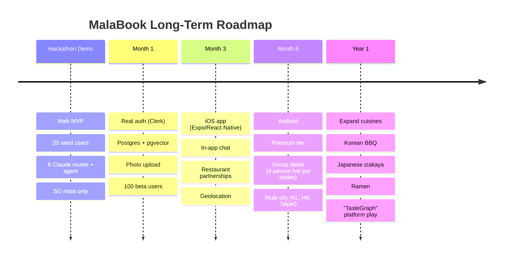

# Post-Hackathon Roadmap

## Key technical evolutions

- JSON seed → Postgres + pgvector for real embedding search
- Replace LLM matching with a small fine-tuned classifier; keep LLM for the human-readable layer
- Restaurant ingestion pipeline (scrape menus, auto-tag spice/style)
- *"Did you actually go?"* feedback loop wired to match-quality learning (already prototyped via B2)
- Privacy: never store exact location, only neighborhood-level
